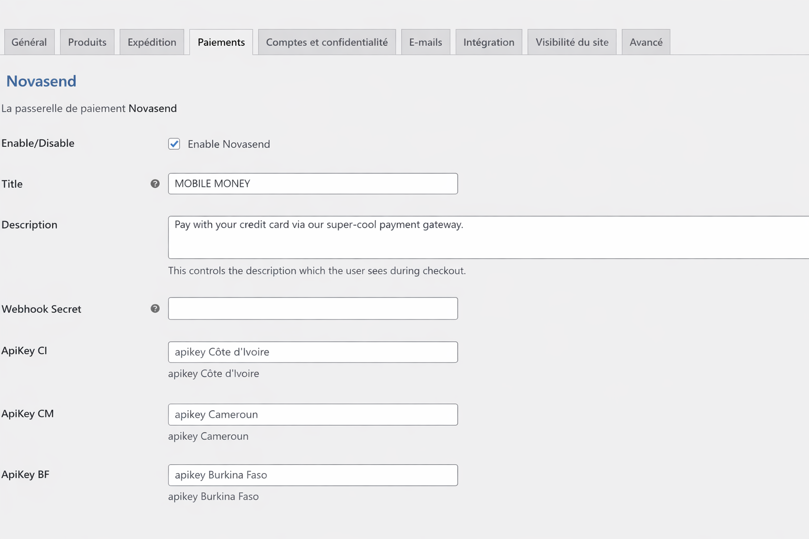
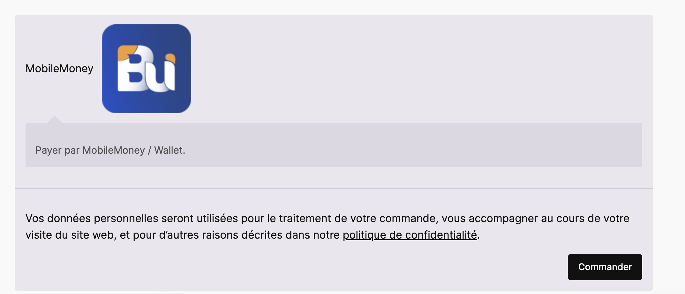
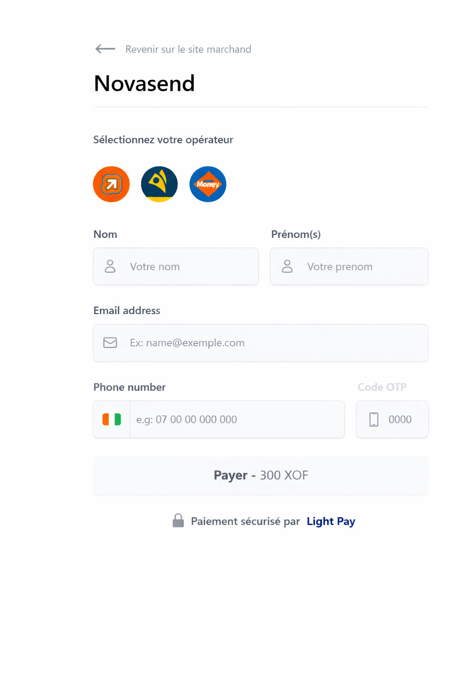
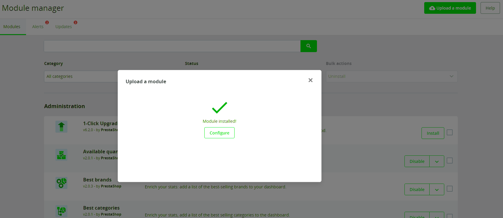

# Plugins E-commerce NovaSend

## Téléchargement rapide

Choisissez le plugin adapté à votre plateforme :

<a href="/NovaSend-Pay-Gateway-for-WooCommerce.zip" download class="download-button">
  Télécharger le plugin WordPress NovaSend
</a>

## Introduction

Les plugins de paiement NovaSend pour WordPress/WooCommerce et PrestaShop permettent aux propriétaires de sites e-commerce d'intégrer facilement nos services de paiement à leur boutique en ligne. Ces plugins sont conçus pour être simples à utiliser et s'intègrent parfaitement à vos plateformes e-commerce existantes.

## Plugin WordPress/WooCommerce

### Fonctionnalités principales

- Compatible avec WooCommerce version 3.7.0 et supérieure
- Compatible avec PHP version 7.4 et supérieure
- Prise en charge des paiements mobiles (Orange Money, MTN Mobile Money, etc.)
- Configuration simple depuis le tableau de bord WordPress
- Gestion automatique des transactions et des statuts de commande

### Prérequis

Avant d'installer le plugin, assurez-vous de :
- Avoir un compte marchand NovaSend actif
- Récupérer votre token API dans votre compte marchand NovaSend
- Vérifier que la devise de votre boutique correspond à celle de votre compte NovaSend
- S'assurer que le pays configuré dans le formulaire de commande correspond au pays de votre compte NovaSend

### Installation

1. Téléchargez le fichier ZIP du plugin depuis votre espace marchand NovaSend.
2. Dans votre tableau de bord WordPress, allez dans `Extensions > Ajouter > Téléverser une extension`.
3. Choisissez le fichier ZIP téléchargé et cliquez sur `Installer maintenant`.
4. Une fois l'installation terminée, cliquez sur `Activer`.

### Configuration

1. Accédez à `WooCommerce > Réglages > Paiements`.
2. Trouvez "NovaSend" dans la liste et activez-le.
3. Cliquez sur "Gérer" pour configurer le plugin.
4. Entrez votre token API NovaSend.
5. Entrez votre secret Webhook NovaSend.
6. Configurez les options de paiement selon vos préférences.
7. Cliquez sur "Enregistrer les modifications".

### Utilisation

Une fois configuré, le plugin NovaSend sera disponible comme méthode de paiement sur la page de commande de votre boutique.

1. Lors de la commande, le client sélectionne son pays.
2. Le client choisit "NovaSend" comme méthode de paiement.
3. Il sera invité à entrer les détails de paiement nécessaires pour finaliser la transaction.

### Page de paiement WordPress

### Dépannage WordPress

En cas de problème :
1. Vérifiez que votre token API est correctement saisi.
2. Activez le mode debug dans les paramètres du plugin pour obtenir plus d'informations sur les erreurs.
3. Assurez-vous que vos versions de WordPress et WooCommerce sont à jour.

## Plugin PrestaShop

<a href="/mynovasend_prestashop_documentation.zip" download class="download-button">
  Télécharger le plugin PrestaShop NovaSend
</a>

### Fonctionnalités principales

- Intégration facile et rapide
- Transactions sécurisées via la passerelle NovaSend
- Compatibilité avec les dernières versions de PrestaShop
- Affichage dans la page de commande
- Vérification automatique de la compatibilité du pays du client avec l'API NovaSend

### Prérequis

Les prérequis sont les mêmes que pour le plugin WordPress.

### Installation

1. Téléchargez le package du module de paiement NovaSend.
2. Dans votre back-office PrestaShop, allez dans `Modules` > `Gestion des modules`.
3. Cliquez sur `Ajouter un nouveau module` et sélectionnez le fichier zip téléchargé.
4. Une fois uploadé, cliquez sur `Installer`.

### Configuration

1. Après l'installation, cliquez sur `Configurer`.
2. Entrez votre token API NovaSend.
3. Sauvegardez la configuration.

### Utilisation

1. Lors du passage en caisse, les clients pourront sélectionner NovaSend comme méthode de paiement.
2. Ils seront redirigés vers le formulaire de paiement NovaSend pour compléter la transaction.
3. Après le paiement, ils seront redirigés vers la page de confirmation de commande.

### Gestion des commandes

- Les commandes payées via NovaSend apparaîtront dans votre back-office PrestaShop sous `Commandes`.
- Le statut de la commande sera automatiquement mis à jour en fonction de la réponse de NovaSend.

### Dépannage PrestaShop

En cas de problème :
1. Vérifiez que votre token API est correctement saisi.
2. Assurez-vous que le module est bien installé et activé.
3. Pour activer le mode debug, modifiez le fichier `config/defines.inc.php` et définissez `_PS_MODE_DEV_` sur `true`.

## Support

Pour toute assistance concernant nos plugins, contactez notre équipe de support :
- Site Web : [Support Officiel NovaSend](https://novasend.app/)
- Documentation : [Documentation NovaSend](https://docs.novasend.app/starting.html)

Cette documentation fournit un aperçu de l'installation, la configuration et l'utilisation des plugins de paiement NovaSend pour WordPress/WooCommerce et PrestaShop. Pour des informations plus détaillées, veuillez consulter notre documentation complète en ligne.