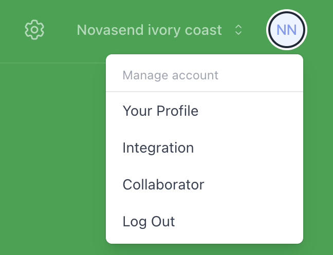
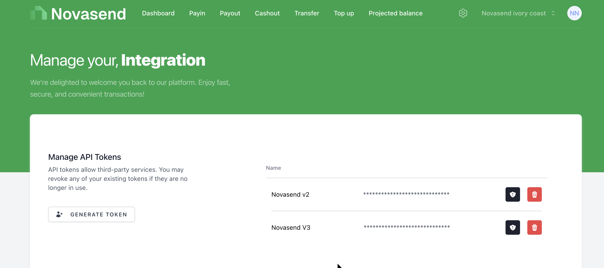
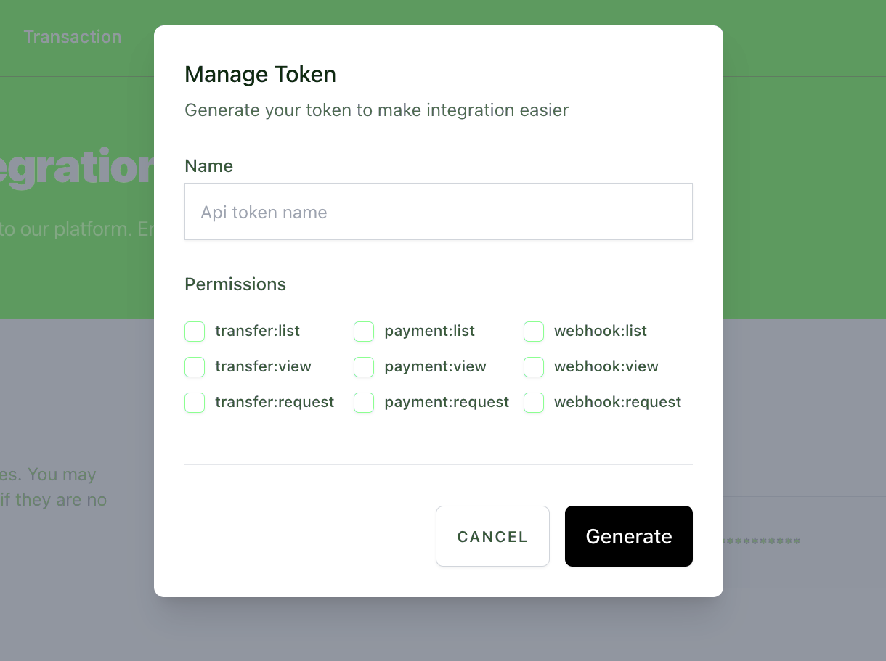

# Get Started

[[toc]]

## Reference

NovaSend APIs provide a way to use your business account outside the portal. With our REST API you can collect money, send money and check your wallet balance.
To use these APIs, you must have a NovaSend account.

## Base Url

All the endpoint paths referenced in the API document are relative to a base URL

```txt
  https://business-api.novasend.app
```

## Authentication

NovaSend APIs use HTTP Bearer authentication.
Each request must contain an authorisation header specifying the bearer scheme with the API key, e.g. Authorisation: Bearer bui_prod_YhUNb9d...

NovaSend will assign an API key to identify your account.
As API keys can be used to make any API request, including those that transfer money and access sensitive information, you should take care to keep your key secret.
Your key must not be shared, stored anywhere other than on your own servers or used in client-side code.

### Token List





### Generate Token



## Authorized Header

For authentication, the Authorization header must be included in the request.
The value consists of the auth scheme, Bearer followed by the api key: `Authorization: Bearer <API key>`

For requests which include a body, the Content-Type header must specify that the body is JSON: `Content-Type: application/json`

To have the content of error messages translated into your language, you can specify the Accept-Language header, for example: `Accept-Language: en`
For the time being, only **fr** and **en** are supported.

## Rate Limiting

NovaSend API calls are rate-limited to avoid abuse that would degrade performance for all our users.
If you send many requests in a short space of time, you risk receiving error **429** responses.

## Errors

When an API request cannot be completed successfully, the response provides information about the failure in the message body and in the HTTP status code.

## Error details

In response to unsuccessful requests, NovaSend provides details about the error in the message body.
This includes, minimally, a short `statusCode` and longer user-readable `message` describing the error.
For validation errors, NovaSend may also provide details of what failed including the field that failed validation and the problem with it.

```json
{
    "error": "Forbidden",
    "statusCode": 403,
    "correlationId": "d84caf0f-0941-4998-8376-68c7c9ab7913",
    "causationId": "de0c0e48-b9bb-46d6-9b6e-341b7b687473",
    "message": "Le portefeuille wt_8601300d5198acf8 n'a pas assez de fonds"
}
```
